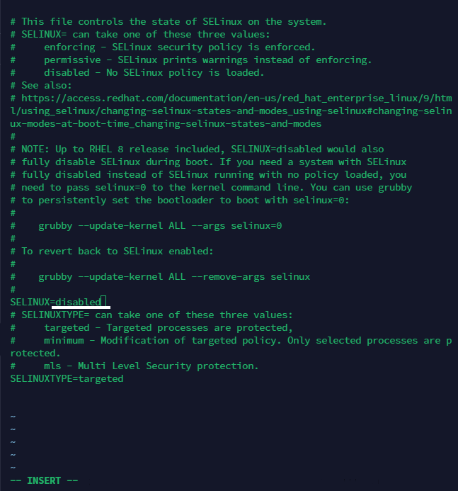

# DevOps-tooling-website-solution

## Architecture

This project implements multiple servers sharing a common database and accessing same network file system (NFS). 
It focuses on creating a website solution for a team of developers. the tools accessible to the team includes

Kubernetes - Open-source platform for automating deployment, scaling, and managing containerized applications. 

Jfrog Artifactory -universal artifact repository manager designed to support all major package formats, build tools, and CI/CD (Continuous Integration/Continuous Deployment) servers. 

Prometheus- Open-source monitoring and alerting toolkit

Kibana - Open-source data visualization and exploration tool designed to work with Elasticsearch

Rancher - An open-source container management platform that provides organizations with tools to deploy, manage, and scale containers across multiple environments such as public clouds and hybrid clouds.

Jenkins- Open-source automation server widely used for building, testing, and deploying software projects

Grafana - Open-source analytics and visualization platform designed for monitoring and observability.

## Prepare NFS Server

First, spin an EC2 instance with RHEL Linux 8 operating system. this will serve as the NFS server. Attache three 10 GB volumes in the same EC2 instance. 
View the attached volumes with `lsblk` command and `df -h` for disc space usage

Run the command to create partitions

 `sudo gdisk /dev/xvdf`
 `sudo gdisk /dev/xvdh`
 `sudo gdisk /dev/xvdg`

follow the prompts as shown.

Using `sudo yum install lvm2 -y` install lvm2 

Create the Physical volumes 

`sudo pvcreate /dev/xvdf1`
`sudo pvcreate /dev/xvdg1`
`sudo pvcreate /dev/xvdh1`

Create a volume group called “nfsdata-vg” comprising of all three disks
`sudo vgcreate nfsdata-vg /dev/xvdh1 /dev/xvdg1 /dev/xvdf1`

Creat three logical volumes of 9GB each using lvcreate. To see the volume group size, run sudo vgs 

`sudo lvcreate -n apps-lv -L 9G nfsdata-vg`
`sudo lvcreate -n logs-lv -L 9G nfsdata-vg`
`sudo lvcreate -n opt-lv -L 9G nfsdata-vg`

Format the logical volumes with xfs filesystem

`sudo mkfs -t xfs /dev/nfsdata-vg/apps-lv`
`sudo mkfs -t xfs /dev/nfsdata-vg/logs-lv`
`sudo mkfs -t xfs /dev/nfsdata-vg/opt-lv`

create the directories and mount logical volumes on the directories

`sudo mkdir -p /mnt/logs`
`sudo mkdir -p /mnt/opt`
`sudo mkdir -p /mnt/apps`

Mount directotories respectively

`sudo mount /dev/nfsdata-vg/opt-lv /mnt/opt`
`sudo mount /dev/nfsdata-vg/logs-lv /mnt/logs`
`sudo mount /dev/nfsdata-vg/logs-lv /mnt/apps`

After Mountain the directories, get the UUID of the mount part. to get the UUID, run `sudo blkid`

paste the UUID in the fstab file.
to access the fstab file, run 
`sudo vi /etc/fstab`

Reload daemon 

`sudo mount -a `
`sudo systemctl daemon-reload`

Install the NFS server and confirm its running

`sudo yum -y update`
`sudo yum install nfs-utils -y`
`sudo systemctl start nfs-server.service`
`sudo systemctl enable nfs-server.service`
`sudo systemctl status nfs-server.service`

TO allow the webservers to access the NFS (read,write and execute) use the chown chmod command to set up permission

`sudo chown -R nobody: /mnt/apps`
`sudo chown -R nobody: /mnt/logs`
`sudo chown -R nobody: /mnt/opt`

`sudo chmod -R 777 /mnt/apps`
`sudo chmod -R 777 /mnt/logs`
`sudo chmod -R 777 /mnt/opt`

`sudo systemctl restart nfs-server.service`

Now Proceed to configure access to NFS for clients within same subnet

Run `sudo vi /etc/exports` command to gain access to the editor. Paste 

/mnt/apps 172.31.16.0/20(rw,sync,no_all_squash,no_root_squash)
/mnt/logs 172.31.16.0/20(rw,sync,no_all_squash,no_root_squash)
/mnt/opt 172.31.16.0/20(rw,sync,no_all_squash,no_root_squash)

To re-export all directories listed in the NFS exports configuration file, run 

`sudo exportfs -arv`

To make the NFS server accessible from client, check ports used by NFS and open it through the security group.

To list the RPC (Remote Procedure Call) services available on a system and filter the output to display only the services related to NFS run 
`rpcinfo -p | grep nfs`

this command lists only the ports to be configured 

## Database Server

Launch a new EC2 instance and install MySQL server in this instance. verify that mysql is running

`sudo yum update -y`

`sudo yum install mysql-server -y`

`sudo systemctl restart mysqld`

`sudo systemctl enable mysqld`

`sudo systemctl start mysqld`

Create a database and name it “tooling”
sudo mysql

`CREATE DATABASE tooling;`

Create a database user called “webaccess”

`CREATE USER 'webaccess'@'172.31.16.0/20' IDENTIFIED BY 'Christy@123';`

Grant permission to this “webaccess” user to have full permissions on the “tooling” database only from the subnet cidr.

`GRANT ALL PRIVILEGES ON tooling.* TO 'webaccess'@'172.31.16.0/20';`

`FLUSH PRIVILEGES;`

`SHOW DATABASES;`

`exit`

test if you can access the db-server remotely with this webaccess user.

### Prepare the Web Servers

Launching three EC2 instance, the web servers, with RHEL 8 Operating System. configure the webservers to serve same content fron NFS Server and MySQL database.

on the web servers, 
Install NFS client

`sudo yum update -y`

`sudo yum install nfs-utils nfs4-acl-tools -y`

Mount `/var/www/` and target the NFS server’s export for apps

`sudo mkdir /var/www`

`sudo mount -t nfs -o rw,nosuid 172.31.29.126:/mnt/apps /var/www`

Run `df -h` to verify NFS was mounted successfully

Edit /etc/fstab file

`sudo vi /etc/fstab`

Add the following to the file setting

`<NFS-Server-Private-IP-Address>:/mnt/apps /var/www nfs defaults 0 0`

Install Remi’s repository, Apache and PHP

`Install Remi, Apache and Php`

`sudo yum install httpd -y`

`sudo dnf install https://dl.fedoraproject.org/pub/epel/epel-release-latest-8.noarch.rpm`

`sudo dnf install dnf-utils http://rpms.remirepo.net/enterprise/remi-release-8.rpm`

`sudo dnf module reset php`

`sudo dnf module enable php:remi-7.4`

`sudo dnf install php php-opcache php-gd php-curl php-mysqlnd`

`sudo systemctl start php-fpm`

`sudo systemctl enable php-fpm`

`setsebool -P httpd_execmem 1 // set for reboot`

Repeat same steps for another 2 Web servers.

Verify that Apache files and directories are available on the Web Server in /var/www and also on the NFS server in /mnt/apps.

Edit the /etc/fstab file so that it persists even after reboot

sudo vi /etc/fstab

`sudo mount -t nfs -o rw,nosuid 172.31.29.126:/mnt/logs /var/log/httpd`

Fork the tooling source code from 
<a href="https://github.com/darey-io/tooling">Darey.io Github Account</a>
 to your Github account.

Download git

sudo yum install git

Clone the repository you forked the project into

git clone <repository link>

Deploy the tooling website’s code to the Webserver. Ensure that the html folder from the repository is deployed to /var/www/html

On the webserver inbound rule, Open TCP port 80 

attempt to restart httpd service, it very likely that it will fail to start at this point stating that httpd service is unable to write to the log directory. If you encounter this error, check permissions to your `/var/www/html` folder to ensure that it is own by root.

Disable SELinux by running 
`sudo setenforce 0`
To make this change permanent, open following config file 

`sudo vi /etc/sysconfig/selinux`

 and 

set SELINUX=disabled 

then restart httpd.

`sudo systemctl restart httpd`

Update the website’s configuration file to connect to the database.

`sudo vi /var/www/html/functions.php`

Apply tooling-db.sql script to your database using this command

`sudo mysql -h 172.31.29.126 -u webaccess -p -D tooling < tooling-db.sql`

On MySQL, ceate a new admin user, 
username: myuser and password: password:
Change to the Devops_tooling directory

Connect to the mySQL server from the webserver using the ‘webaccess’ user created earlier and the private IP of the DB server.

`sudo mysql -h 172.31.24.27 -u webaccess -p`

Create a new admin user in MySQL  by running the following SQL query

INSERT INTO 'users' ('id', 'username', 'password', 'email', 'user_type', 'status') VALUES
-> (1, 'myuser', '5f4dcc3b5aa765d61d8327deb882cf99', 'user@mail.com', 'admin', '1');

Open the website on the browser and log in

